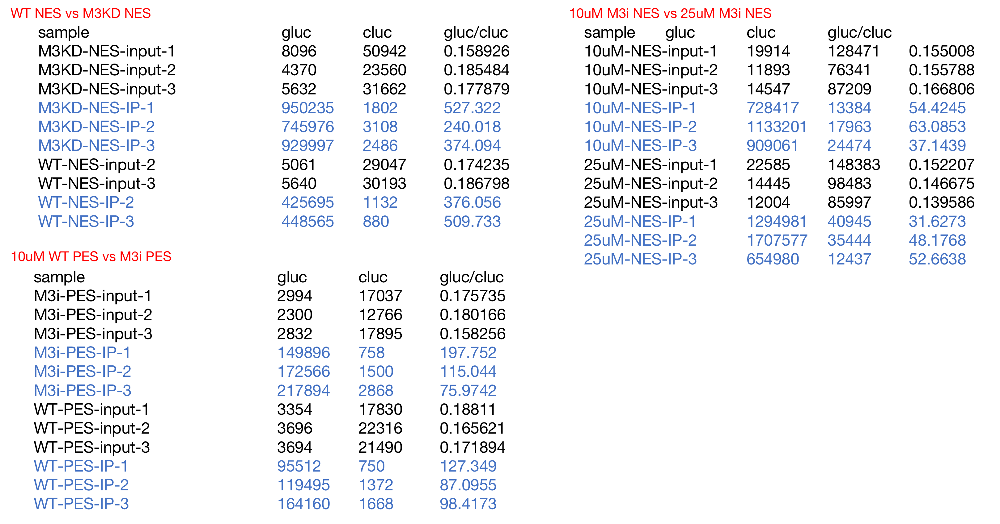
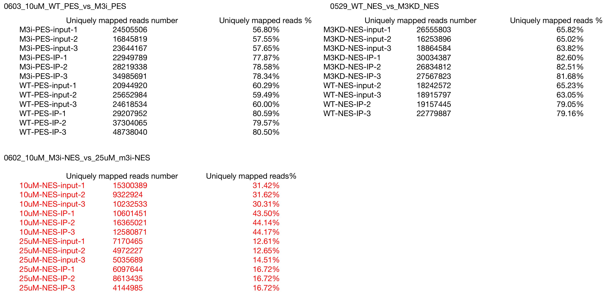
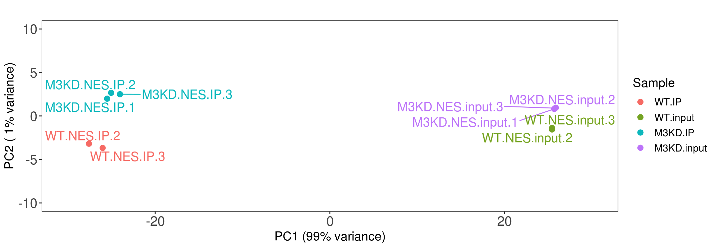
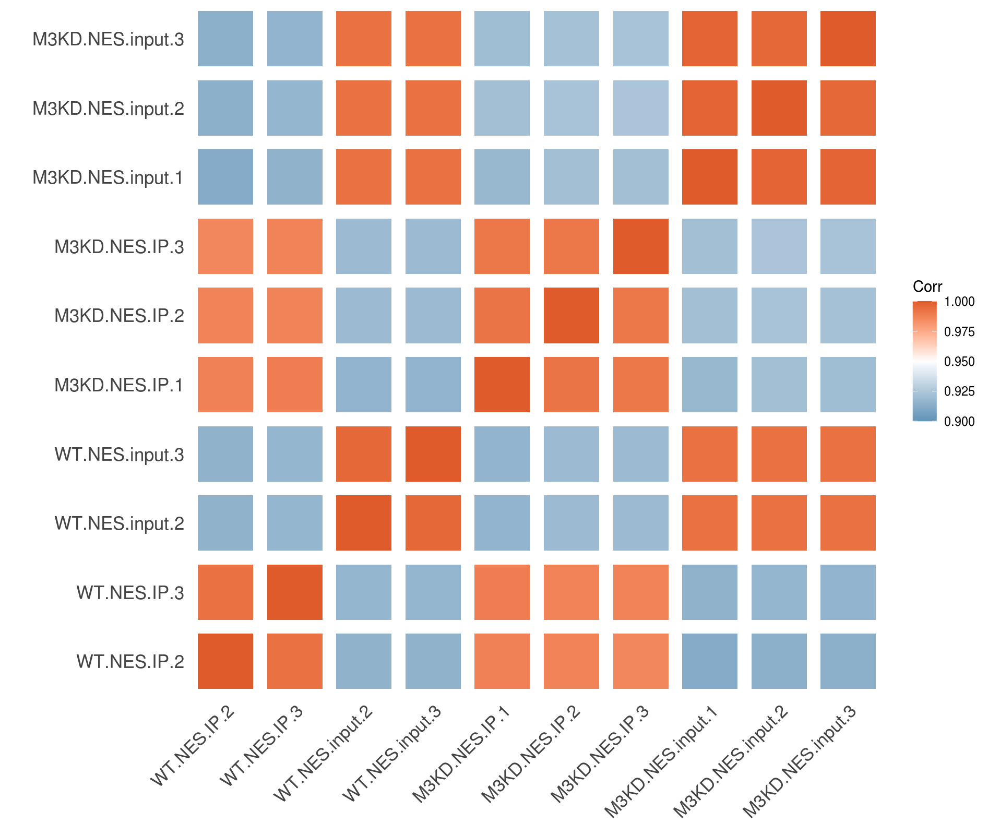
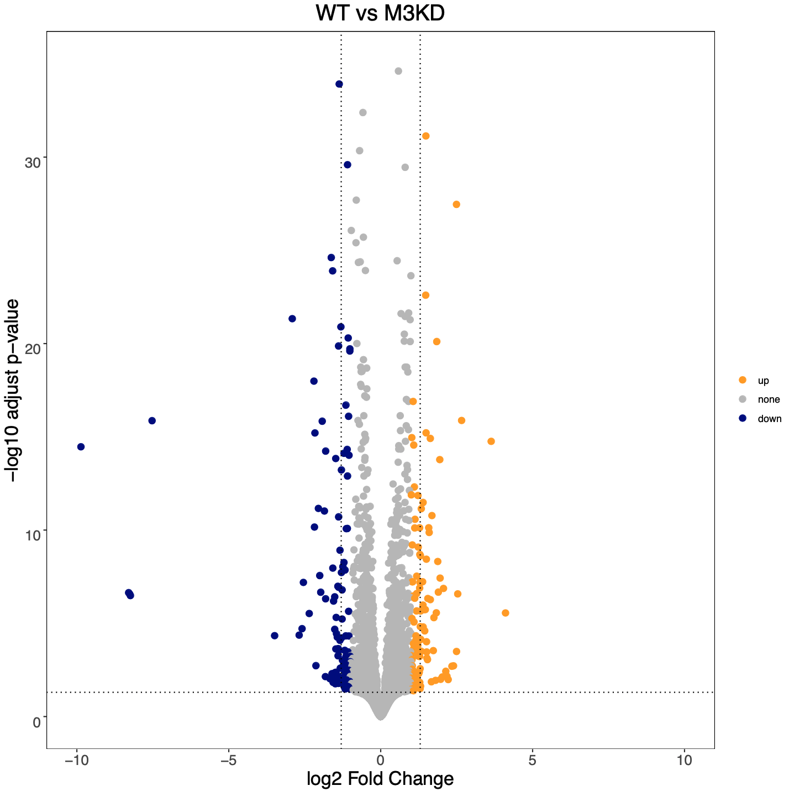
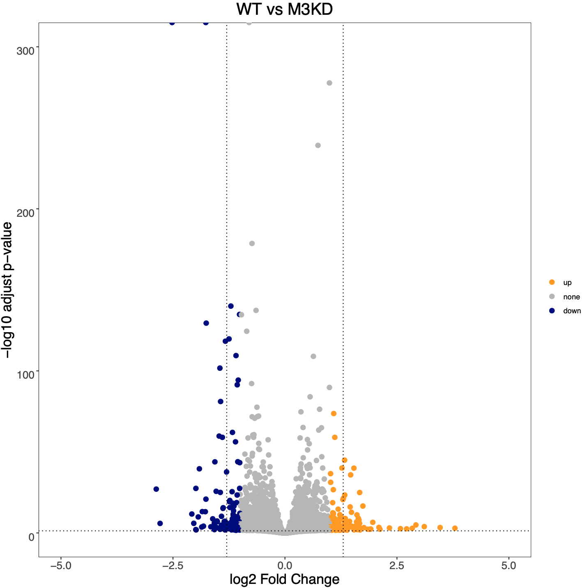

20220603批数据
=================================

20220603批数据: 

IP effciency
~~~~~~~~~~~~~~~~~~~~~~~~~~~~~~

Mapping ratio
~~~~~~~~~~~~~~~~~~~~~~~~~~~~~~

0602批数据需要加测, unmapped较多, 主要map Mm

Correlation
~~~~~~~~~~~~~~~~~~~~~~~~~~~~~~

M3KD vs WT NES:

PCA结果:

PCC结果:

M3i vs WT PES:

PCA结果:

.. image:: ../_static/img/thumbnail/m3i_wt_nes_pca.png
   :height: 400px
   :align: center

PCC结果:

.. image:: ../_static/img/thumbnail/m3i_wt_nes_pcc.png
   :height: 400px
   :align: center

Differential Gene Analysis
~~~~~~~~~~~~~~~~~~~~~~~~~~~~~~

M3KD vs WT NES:

差异基因分析火山图:

GO分析:

仅downgene在GO上富集:

.. image:: ../_static/img/thumbnail/m3kd_wt_nes_downgene.png
   :height: 400px
   :align: center

M3i vs WT PES:

差异基因分析火山图:

GO分析:

仅downgene在GO上富集:

.. image:: ../_static/img/thumbnail/m3i_wt_pes_downgene.png
   :height: 400px
   :align: center

