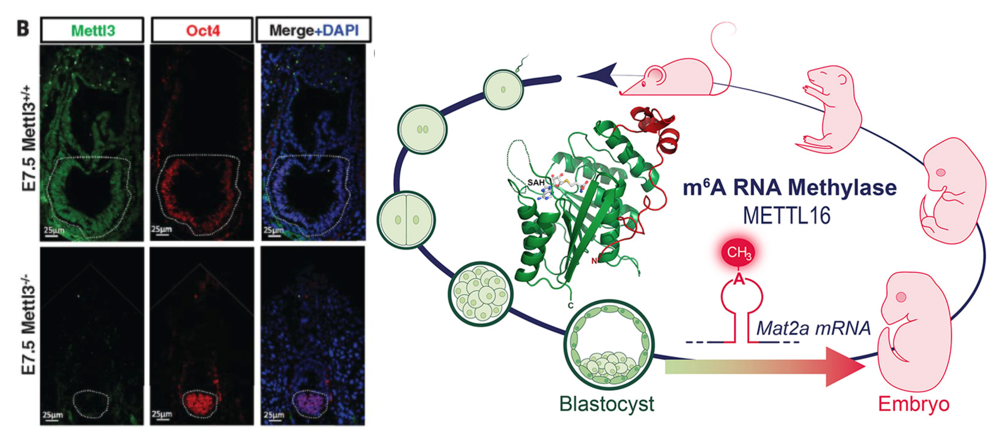

.. MultiSpace documentation master file, created by
   sphinx-quickstart on Sun Jun 19 10:33:38 2022.
   You can adapt this file completely to your liking, but it should at least
   contain the root `toctree` directive.

Human ESC m6A analysis results
====================================

.. toctree::
   :maxdepth: 2
   :caption: Contents:

|Docs|

.. |Docs| .. image:: https://readthedocs.org/projects/humanesc/badge/?version=latest
   :target: https://humanesc.readthedocs.io

Human ESC m6A analysis results.

.. include:: release_notes/0.0.1.rst

.. toctree::
   :maxdepth: 1
   :hidden:

   pipeline
   examples
   release_notes/index

